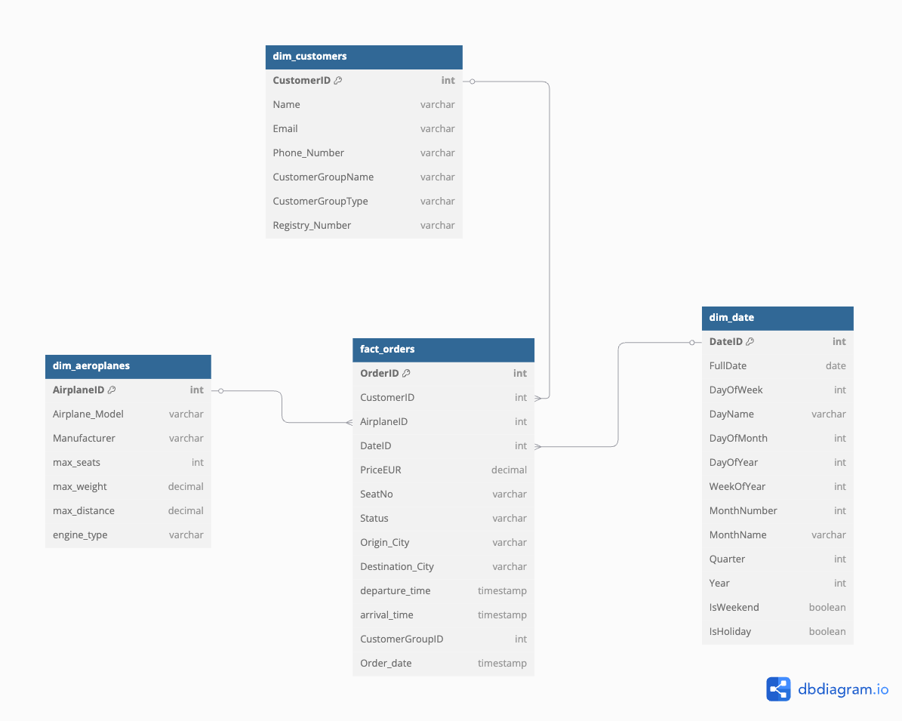

## Project Overview
This is a pure dbt project designed to transform Air Boltic’s raw data into a well-modeled data warehouse. It ingests CSV/JSON files from S3, applies cleaning and transformation logic in dbt, and produces streamlined tables ready for analytics. The focus is on clear, testable models and efficient structures that scale with business needs. All code and configurations are maintained in a central GitHub repo for version control and collaboration
  - **Data Source**: CSV/JSON files in S3
  - **Destination**: S3 as Parquet and CSV files
  - **Requirements**: Github AWS keys
  - **highlights**: 
    - ?


## Tech Stack
  - S3, dbt, duckdb, Tableau, GitHub Actions

## Data Validation
By defining strict table schemas and reference constraints, we ensure data validation and enforce a consistent contract, so only clean, reliable data flows into analytics

## Data Model Explanation

*Fig 1: Star data warehouse data model*
*Fig 1: columns data type are outdated*


## Project Structure
```
transform/
├── macros/           # macros
├── models/           # Core dbt transformation logic
│   ├── staging/      # Initial data cleaning
│   └── marts/        # Final presentation tables
├── tests/            # Data quality tests
├── dbt_project.yml   # dbt configuration
└── profiles.yml      # profile
```

## Setup & Installation
```bash
git clone https://github.com/your-username/x
cd bolt-data
uv venv --python 3.12
uv pip install -r requirements.txt
make debug
make run
```

## demo presenting
[Tableau public](https://public.tableau.com/app/profile/ebrahim.espootin/viz/demo1_17392217179420/Dashboard1/)

### Questions & Responses
- How **"self-service analysis"** will make happen for the business users?
  - We transform raw data (from Sheets/JSON) into clean, analytics-ready datasets through dbt. The final outputs are delivered to a target path in S3 (organized and structured). From there, presentation/BI tools (like Looker) can directly connect or read the curated datasets in S3. Because each table and field is clearly defined, business users can easily create their own reports and dashboards—giving them the freedom to explore insights without heavy IT support
- "enable monitoring" 
  - We use dbt’s built-in testing and logging features to monitor data quality.
- why you have designed such a data model?
  - We designed a star analytics model (fact table surrounded by dimensions) so data can be fetched quickly and analyzed with fewer joins. This structure helps business users run queries efficiently, making it easier to build dashboards or reports that deliver fast, meaningful insights. It’s straightforward to expand and maintain, ensuring smooth scalability as more data comes in.
- what would you do if you had more time for the task ?
  - Improve Data Validation
	-	Performance Tuning with indexes, partitioning
  - improve CI/CD
  

### Questions & Responses (Part 2)
- How would you envision the ideal CI/CD process to implement these changes over time???
  - use Autoloader continuously ingests new data from sources (like S3) into staging tables
  - use Databricks Asset Bundles (DABs) for package and version 
  - use DLT tables
  - make integration test for stage environment
- How would your answer differ in the real world use case where resources are limited and perfect tooling might not be available? - What are some of the low effort/short term and high effort/long term things you would suggest we implement?
  - In a real-world setup with limited resources, we adapt our approach to fit the actual budget and tooling constraints. Here’s how we’d break it down:
	1.	Low Effort / Short Term (When Budget Isn’t Tight)
	•	Use Databricks & Autoloader: Quickly ingest and process data at scale with minimal overhead. Databricks handles the infrastructure, making data pipelines simpler to manage.
	2.	High Effort / Long Term (Budget Constraints)
	•	Local Dev with Docker or On-Prem: Stand up a small dev/staging environment on-prem or in Docker to manage costs. This covers compute needs without the full Databricks stack.
	•	BI-as-Code: Keep dashboards and reporting logic in Git (e.g., versioned LookML, or code-based BI solutions) to ensure collaboration, rollback, and clarity around changes.


## added tips :databricks
  - Databricks community edition doesn't support Autoloader
  - Databricks Autoloader is not cover xlsx


