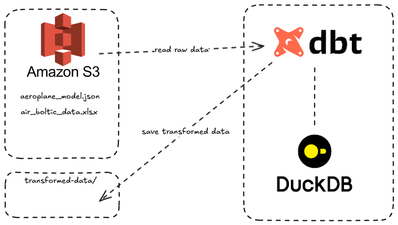

## Project Overview
A simplified dbt project for transforming Air Boltic’s raw data into a ready-to-query data warehouse. It ingests XLSX/JSON files from S3, cleans and models them via dbt, and outputs analytics-friendly tables. This setup uses GitHub for version control and fosters a scalable, testable data pipeline.
  - **Data Sources**: XLSX/JSON in S3  
  - **Destination**: CSV/Parquet in S3  
  - **Requirements**: GitHub, AWS S3 Bucket, AWS Keys


### Tech Stack
  - AWS S3, dbt, DuckDB, Tableau, GitHub Actions
  - 

### Data Validation
Consistent schema and reference constraints ensure reliable data. Each dataset is validated before analytics.

### Data Model Explanation

*Fig 1: Star schema with fact table and dimensions*


## Project Structure
```
transform/
├── macros/           # macros
├── models/           # Core dbt transformation logic
│   ├── staging/      # Initial data cleaning
│   └── marts/        # Final presentation tables
├── tests/            # Data quality tests
├── dbt_project.yml   # dbt configuration
└── profiles.yml      # profile
```

### Setup & Installation
- Prerequisites : Python 3.12, S3 Bucket, S3 keys
```bash
git clone https://github.com/e-espootin/flightflow-dbt-analytics
cd flightflow-dbt-analytics
uv venv --python 3.12
source .venv/bin/activate
cp .env.template .env
make build
```


## Showcase
A sample Tableau Public analysis: 
[Tableau public](https://public.tableau.com/app/profile/ebrahim.espootin/viz/demo1_17392217179420/Dashboard1/)

### FAQ
- why you have designed such a data model?
  - Organized for quick queries with fewer joins, supporting analytics and dashboards.
- what would you do if you had more time for the task ?
  - More data validation
	-	Performance Tuning with indexes, partitioning
  - Enhanced CI/CD
  - Potential PySpark integration

- How **"self-service analysis"** will make happen for the business users?
  - We deliver finalized, structured tables to S3. Tools like Looker connect to them seamlessly, letting teams build their own dashboards.
- How would you envision the ideal CI/CD process to implement these changes over time?
  - Use automated ingestion (e.g., Databricks Autoloader), robust packaging (Databricks Asset Bundles), integration tests, versioning in Git.

  
- How would your answer differ in the real world use case where resources are limited and perfect tooling might not be available?
  - Adapt to budget/tooling:
    - Low Effort/Short Term: Databricks & Autoloader for scalable ingestion.
    - High Effort/Long Term:
      - Enhance Databricks CI/CD and uses Databricks Asset Bundles(DABs).
      - Kubernetes environment for cheaper dev/stage.
      - PySpark for large-scale processing.
      - BI-as-Code (Git) for collaboration/rollback.
      - Advanced DBT tests for data quality.


